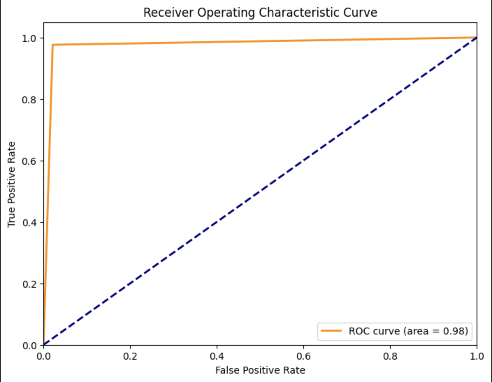
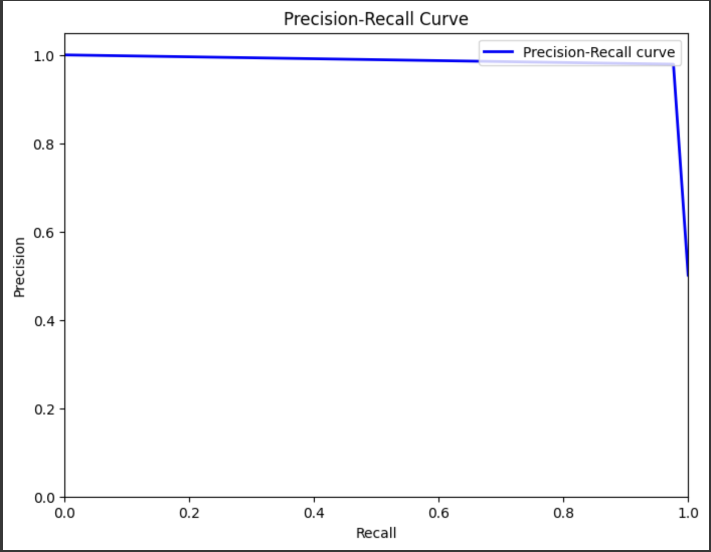
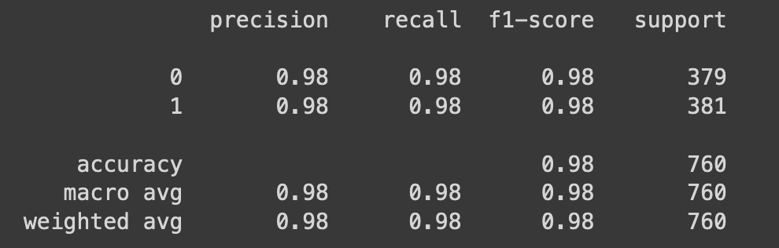

# Email Spam Classification with DistilBERT

This repository contains code for training and evaluating a text classification model for email spam classification using the DistilBERT architecture from Hugging Face Transformers in a Google Colab environment.

## Overview

This code performs the following tasks:

- Loads a dataset of email data from Google Drive.
- Preprocesses the email content by cleaning HTML tags and encoding labels (spam or non-spam).
- Splits the dataset into training and testing sets.
- Tokenizes the email text data using the DistilBERT tokenizer.
- Initializes a pre-trained DistilBERT model for sequence classification.
- Trains the model on the training dataset.
- Evaluates the model's performance on both the training and testing datasets.
- Saves the trained DistilBERT model for future use.

## Results

## Requirements

- Python 3.6+
- Google Colab environment
- Internet connection

## Usage

1. Open the notebook `Text_Classifier.ipynb` in Google Colab.
2. Run each cell in the notebook sequentially.
3. Follow the instructions in the notebook for any necessary inputs, such as the file path and column names.

## Dataset

The dataset used for email spam classification should be in CSV format, with one column containing the email text and another column containing the corresponding labels (spam or non-spam).

## Model

The model architecture used for email spam classification is DistilBERT, a smaller and faster version of the BERT model. DistilBERT is suitable for training on larger datasets like email data.

## Evaluation

The model's performance is evaluated using standard classification metrics such as accuracy, precision, recall, and F1-score. The classification report provides metrics for each class (spam and non-spam) as well as overall performance.

## License

This code is licensed under the [MIT License](LICENSE).

## Contributing

Contributions are welcome! If you find any issues or have suggestions for improvements, feel free to open an issue or submit a pull request.
